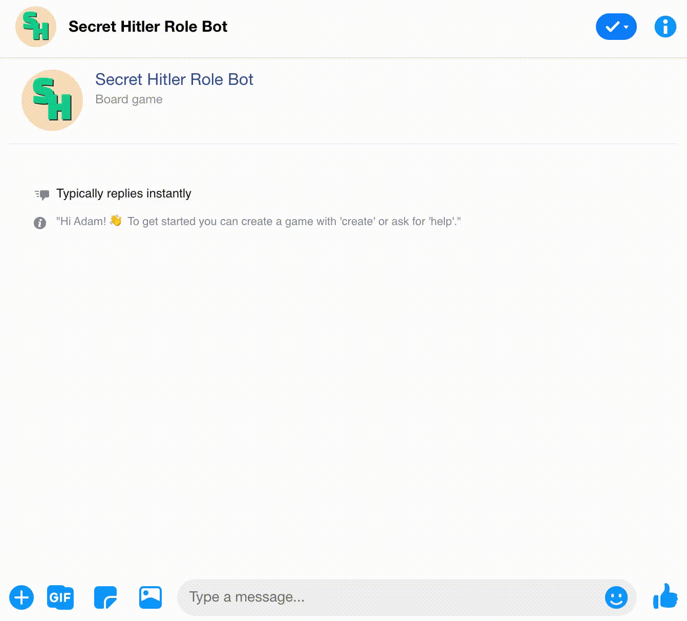

# 🎲 SH Role Bot

  

A chatbot that allows users to allocate roles for the board game Secret Hitler, using the AWS serverless platform. ⚡

- Integrates with [Facebook Messenger](https://m.me/shrolebot) ([dev](https://m.me/shroledevbot)) and [Telegram](https://t.me/shrolebot) ([dev](https://t.me/shroledevbot)). 🔌
- Uses AWS Lambda, DynamoDB and CloudFormation to be performant, scalable, and student budget friendly! 💸
- Automated releases and deployments to separate dev and prod environments. 🚧

## ✨ Demo

## 🔧 Setup

| NPM command     | What it does                 |
|-----------------|------------------------------|
| `install`       | Install dependencies         |
| `lint`          | Find lint issues             |
| `lint:fix`      | Fix most lint issues         |
| `test`          | Run unit tests               |
| `test:watch`    | Run unit tests in watch mode |
| `deploy:dev`    | Deploy to dev environment    |
| `deploy:prod`   | Deploy to prod environment   |
| `teardown:dev`  | Teardown dev environment     |
| `teardown:prod` | Teardown prod environment    |

## 🙌 Contributing

See the [contributing](CONTRIBUTING.md) document for details.